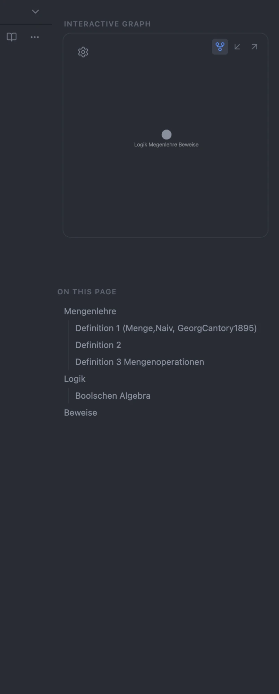
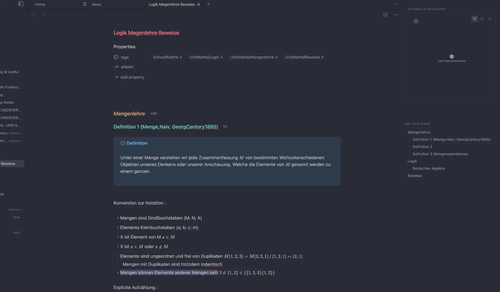
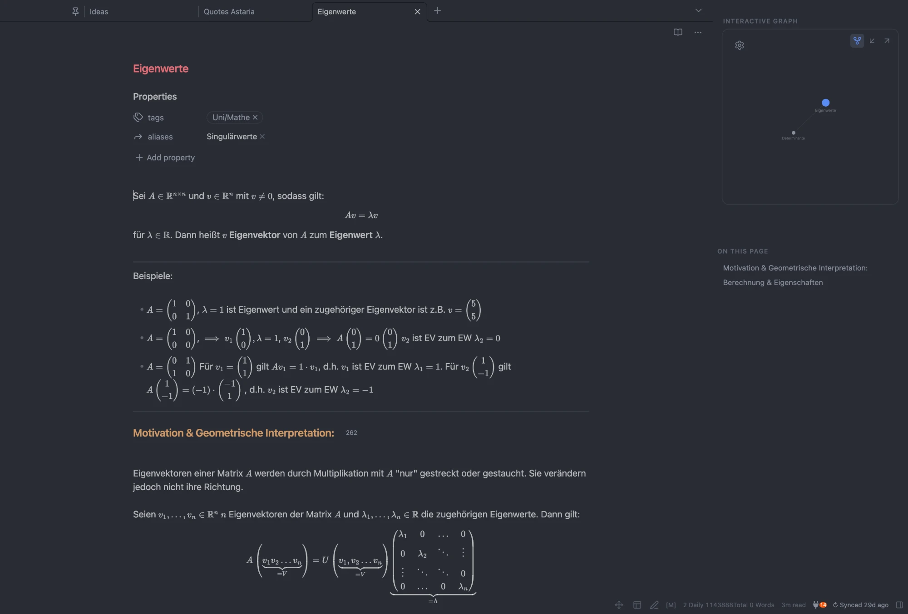

# Hub Sidebar

Give Obsidian's right sidebar an **Obsidian Publish** ("Obsidian Hub") look — a
framed local-graph card and a clean "On this page" outline — plus the one thing
CSS can't do: a real, clickable **Graph / Incoming / Outgoing** switcher on the
graph card.



## Features

- **Framed graph card** — wraps the local graph (and Backlinks / Outgoing Links)
  in a rounded, borderless box, with adjustable shape and top offset.
- **One-click switcher** — buttons on the card morph it between the local graph,
  incoming links (backlinks), and outgoing links, in place.
- **Section labels** — "Interactive graph" / "On this page" headers, Publish-style.
- **Clean outline** — a plain-text "On this page" list: no chevrons, no toolbar,
  with a configurable heading depth (1–3 tiers).
- **Borderless sidebar** — removes the hairline borders (the editor↔sidebar
  divider is an optional toggle).
- **Center note on screen** — optional: keeps the editor column centered in the
  window when the sidebar is open.
- **Right-sidebar toggle** — a command (assignable to a hotkey) and an optional
  status-bar button to hide/show the sidebar.
- **New-tab search**: a search box on the empty "New tab" page; press Enter to run a
  full-text search of your vault. On by default; complements the page's built-in
  "Go to file" quick switcher.

## Screenshots





## Settings

Outline heading tiers · graph switcher · section labels · hide tab bar · sidebar
divider line · graph box shape (with a live preview) · graph box top padding ·
center note on screen · right-sidebar toggle button · new-tab search field.

## Development

A TypeScript project bundled with esbuild (entry `src/main.ts` → root `main.js`).

```bash
npm install          # install dev dependencies
npm run dev          # esbuild watch build (inline sourcemap, no minify)
npm run build        # tsc --noEmit typecheck, then a minified production bundle
npm run lint         # eslint with the Obsidian plugin-guideline rules
```

`styles.css` is hand-written at the repo root and auto-loaded by Obsidian.
`main.js` and `styles.css` are committed — they are the release assets.

## Release

```bash
npm version <x.y.z>  # bumps package.json, syncs manifest.json + versions.json, makes a bare tag
git push --follow-tags
```

Pushing the tag triggers `.github/workflows/release.yml`, which lints, builds,
verifies `manifest.json` matches the tag, attests build provenance, and publishes
a GitHub release with `main.js`, `manifest.json`, and `styles.css`.

## Notes

- Needs Obsidian **1.7.2+** (declared as `minAppVersion`).
- Theme-agnostic (core selectors + CSS variables); tuned to sit well with the
  Minimal theme.
